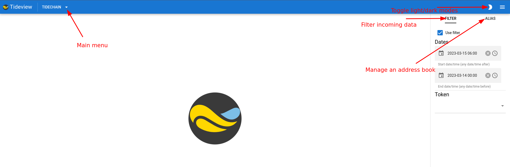
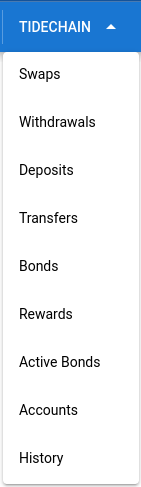
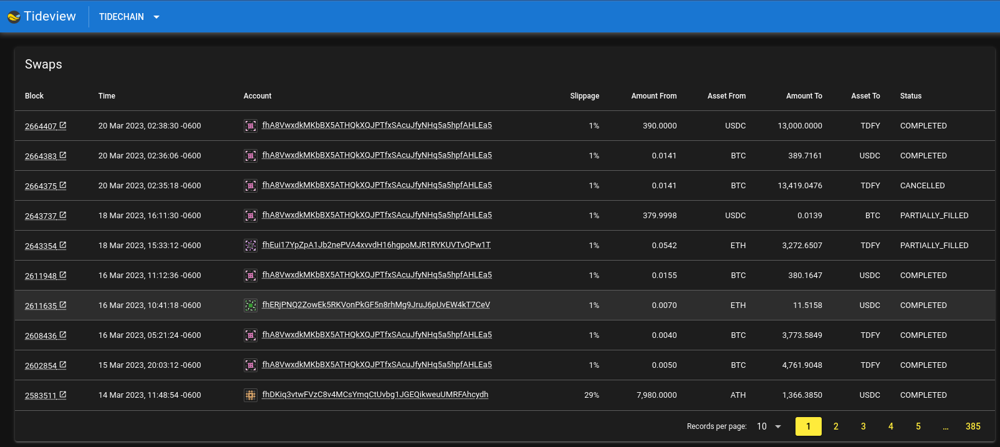

# Welcome to Tideview, the website that gives you insight into the Tidechain network.



## Main menu

The main menu lets you see different areas of Tidechain



Selecting one of these menu items will let you do a deep dive into the data.

The `History` menu item lets you look at all of this data for a single account.

## Swaps

As an example, let's look at the `Swaps` page (also, as you can see, **Dark** mode has been turned on).



Almost all pages has a **Block** column that has a link with an icon indicating an external link. Clicking this will open a new tab on your browser to the **Tidechain Explorer** specifically on that block.

On a lot of the pages, you may also see an **Account Id** which is also a link, but does not have the external link icon attached to it. Clicking this type of link will take you to the `History` page for the clicked account.

## History

The `History` page incorporates all other pages onto a single page, but for a specific **Account Id**.

The link at the top of the page for the **Accound Id** shows the icon indicating an external link. Clicking this link will take you to the [Bonding Dashboard](https://bonding.tidefi.io) for that account.

## Filters

The `FILTER` tab allows you to filter specific data, such as `dates` and `tokens`. You can use the checkbox `Use Filter` to toggle this usage on or off.

## Alias

The `ALIAS` tab allows you to manage contacts. If you add an alias, then the name you created for the contact will be used instead of the **Account Id**.

---

## Building this Project

This project is a [Quasar Framework](https://github.com/quasarframework/quasar) app.

### Install the dependencies
```bash
yarn
```

### Start the app in development mode (hot-code reloading, error reporting, etc.)
```bash
quasar dev
# or
yarn dev
```


### Lint the files
```bash
yarn lint
```

### Build the app for production
```bash
quasar build
```

### Customize the configuration
See [Configuring quasar.config.js](https://v2.quasar.dev/quasar-cli-webpack/quasar-config-js).
